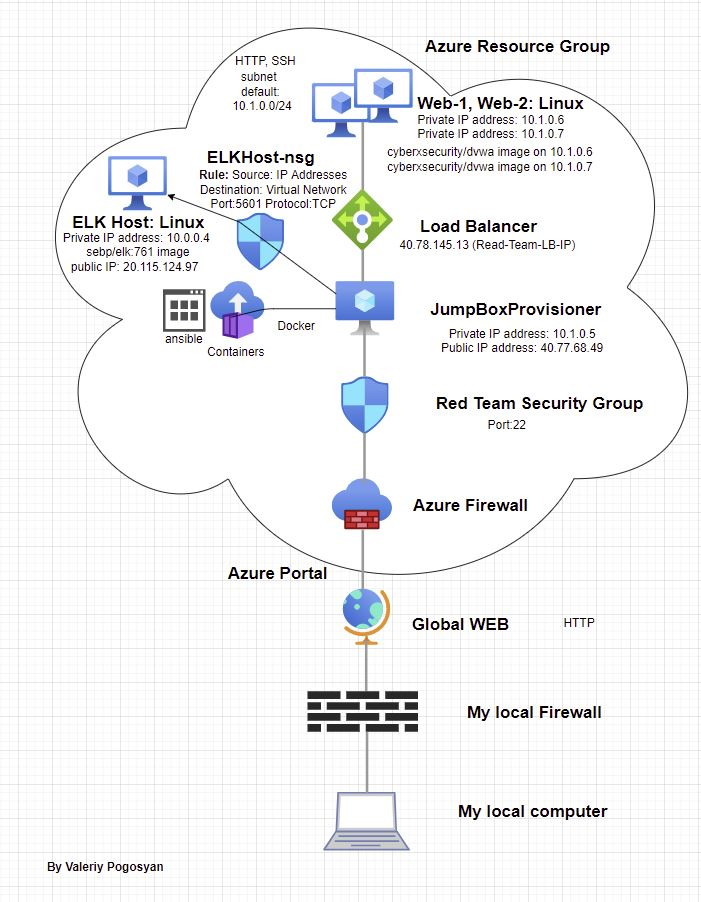

# Cybersecurity
Project files for Linux SysAdmin Fundamentals, Azure private network for using by Red and Blue teams, etc.

## Automated ELK Stack Deployment

The files in this repository were used to configure the network depicted below.

These files have been tested and used to generate a live ELK deployment on Azure. 
They can be used to either recreate the entire deployment pictured above. Alternatively, select portions of the install-elk.yml file may be used to install only certain pieces of it, such as Filebeat.

  https://github.com/ValeriyPogosyan/Cybersecurity/blob/main/Ansible/install-elk.yml

This document contains the following details:
- Description of the Topology
- Access Policies
- ELK Configuration
  - Beats in Use
  - Machines Being Monitored
- How to Use the Ansible Build

### Description of the Topology

The main purpose of this network is to expose a load-balanced and monitored instance of DVWA, the D*mn Vulnerable Web Application.

Load balancing ensures that the application will be highly available, in addition to restricting downtime to the network.

      A load balancer defends an organization against distributed denial-of-service (DDoS) attacks.
	  It can do this by shifting attack traffic from the corporate server to a public cloud provider.

 What is the advantage of a jump box?
 
 A jump server is a hardened and monitored device that spans two dissimilar security zones and provides a controlled means of access between them. 

Integrating an ELK server allows users to easily monitor the vulnerable VMs for changes to the data and system logs.

	What does Filebeat watch for?
	
	Filebeat monitors the log files or locations that you specify, collects log events, and forwards them either to Elasticsearch or Logstash for indexing.
	
    What does Metricbeat record?
	
	Metricbeat takes the metrics and statistics that it collects and ships them to the output that you specify, such as Elasticsearch or Logstash.
	Metricbeat helps you monitor the servers by collecting metrics from the system and services running on the server.

The configuration details of each machine may be found below.

| Name     | Function 		 | IP Address | Operating System |
|----------|-----------------|------------|------------------|
| Jump Box | Gateway         | 10.1.0.5   | Linux            |
| Web-1    |dvwa image holder| 10.1.0.6   | Linux            |
| Web-2    |dvwa image holder| 10.1.0.7   | Linux            |
| ELKHost  |elk image holder | 10.0.0.4   | Linux            |

### Access Policies

The machines Web-1 and Web-2 on the internal network are exposed to the Internet only via loadbalancer's public IP.

The Jump Box machine can accept connections from the Internet.
Access to this machine is allowed from the following IP address:

- 99.253.237.50 which is the public IP address of my laptop.

 Which machine did you allow to access your ELK VM? What was its IP address?
 
 - from my personal computer's IP at port 5601
 - from the containers located at JumpBox via SSH azureuser@10.0.0.4
 
A summary of the access policies in place can be found in the table below.

| Name     | Publicly Accessible   | Allowed IP Addresses                      |
|----------|-----------------------|-------------------------------------------|
| Jump Box | yes                   | Restricted to my personal computer IP only|
| Web-1    | yes, via loadbalancer | 40.78.145.13 at port 80                   |
| Web-2    | yes, via loadbalancer | 40.78.145.13 at port 80                   |
| ELKHost  | yes                   | Public IP at port 5601 (Kibana), SSH      | 

### Elk Configuration

 Ansible was used to automate configuration of the ELK machine. No configuration was performed manually.
 
 What is the main advantage of automating configuration with Ansible?
 
 Ansible helps users to address complicated tasks to configure diverse settings of VMs and environments in automated fashion
 It also eliminates human errors since the process is using scripts. 

The playbook implements the following tasks:

	- Install python3-pip
	- Install Docker module
	- download and launch a docker elk container
	- Enable service docker on boot

The following screenshot displays the result of running `docker ps` after successfully configuring the ELK instance.

https://github.com/ValeriyPogosyan/Cybersecurity/blob/main/Images/dockerps.JPG

### Target Machines & Beats
This ELK server is configured to monitor the following machines:

- 10.1.0.6  (Web-1)
- 10.1.0.7  (Web-2) 

We have installed the following Beats on these machines:

- filebeat
- metricbeat   

These Beats allow us to collect the following information from each machine:
	
 -  Filebeat are used to monitor the Elasticsearch log files, collect log events, and ship them to the   monitoring cluster.
    The recent logs are visible on the Monitoring page in Kibana.
	
 -  Metricbeat is collecting data about Elasticsearch.
    It is the measurement of behaviour and usage of system resources that can be collected and monitored from the system.
	
### Using the Playbook
In order to use the playbook, you will need to have an Ansible control node already configured.

Assuming you have such a control node provisioned: 

SSH into the control node and follow the steps below:

- Copy the filebeat-config.yml file to /etc/ansible/filebeat-config.yml.
- Update hosts file to replace the IP address with the IP address of ELK machine:

		output.elasticsearch:
		hosts: ["10.1.0.4:9200"]
		username: "elastic"
		password: "changeme

		and
		
		setup.kibana:
        host: "10.1.0.4:5601"
		
- Create a playbook in /etc/ansible/roles/filebeat-playbook.yml

- Run the playbook, and navigate to http://[ElkHost Public IP]:5601/app/kibana#/home/tutorial/systemLogs 
  to check that the installation worked as expected.

	https://github.com/ValeriyPogosyan/Cybersecurity/blob/main/Images/Capture%202.JPG
	
	https://github.com/ValeriyPogosyan/Cybersecurity/blob/main/Images/Capture%201.JPG

 Answer the following questions to fill in the blanks:
 
- Which file is the playbook? Where do you copy it? 

   Playbooks are the files with Ansible code written in YAML format.
   Location: /etc/ansible

- Which file do you update to make Ansible run the playbook on a specific machine? 
                
				in /etc/ansible/hosts
				.....
				[webservers]
				#alpha.example.org
				#beta.example.org
				#192.168.1.100
				#192.168.1.110
				10.1.0.6 ansible_python_interpreter=/usr/bin/python3
				10.1.0.7 ansible_python_interpreter=/usr/bin/python3

				[elk]
				10.0.0.4 ansible_python_interpreter=/usr/bin/python3
				......

			Elk host is running in different virtual network so we have to add elk to a separate group.

   How do I specify which machine to install the ELK server on versus which to install Filebeat on?
   
   in filebeat-config.yml
   
   ELK:
   ....
   host: "10.0.0.4:5601" # TODO: Change this to the IP address of your ELK server
   ....
   
   FileBeat:
   ....
   hosts: ["10.0.0.4:9200"]
   ....
        
- Which URL do you navigate to in order to check that the ELK server is running?

	http://[ElkHost Public IP]:5601/app/kibana#/home
	
	Note: The IP address of ELK host is not static.
	
### Using Kibana

Observability

- Navigate to Kibana site : http://[ElkHost Public IP]:5601/app/kibana#/home 
  Note: after restarting the VMs the public IP should be updated
  
  Filebeat:
  
- Click Add Log Data => System Logs
- Under Getting Started select DEB then System logs dashboard
- We can see the Dashboards [Filebeat System] ECS panel for Web-1 and Web-2 with the follwing sections:

   -Syslog events by hostname [Filebeat System] ECS
   -Syslog hostnames and processes [Filebeat System] ECS
   -Syslog logs [Filebeat System] ECS
   
   The last section shows the follwing columns:
   

|  Time   |	 host.hostname   | process.name	  |   message  |
|---------|------------------|----------------|------------|

Sample data:

|Dec 22, 2021 @ 22:01:30.000| Web-1	| metricbeat |
|---------------------------|-------|------------|
|2021-12-23T03:01:30.196Z#011INFO#011[monitoring]#011log/log.go:145#011Non-zero metrics in the last 30s#011{"monitoring": {"metrics":{"beat":{"cpu":{"system":{"ticks":47870,"time":{"ms":86}},"total":{"ticks":114720,"time":{"ms":245},"value":114720},"user":{"ticks":66850,"time":{"ms":159}}},"handles":{"limit":{"hard":4096,"soft":1024},"open":15},"info":{"ephemeral_id":"a315f246-8ba2-49f2-94cd-fb7dd65793e8","uptime":{"ms":12422569}},"memstats":{"gc_next":14417264,"memory_alloc":12207272,"memory_total":16528576368},"runtime":{"goroutines":67}},"libbeat":{"config":{"module":{"running":0}},"output":{"events":{"acked":66,"batches":9,"total":66},"read":{"bytes":3541},"write":{"bytes":123959}},"pipeline":{"clients":4,"events":{"active":0,"published":66,"total":66},"queue":{"acked":66}}},"metricbeat":{"docker":{"container":{"events":3,"success":3},"cpu":{"events":3,"success":3},"diskio":{"events":3,"success":3},"info":{"events":3,"success":3},"memory":{"events":3,"success":3},"network":{"events":3,"success":3}},"system":{"cpu":{"events":3,"success":3},"load":{"events":3,"success":3},"memory":{"events":3,"success":3},"network":{"events":12,"success":12},"process":{"events":21,"success":21},"process_summary":{"events":3,"success":3},"socket_summary":{"events":3,"success":3}}},"system":{"load":{"1":0.01,"15":0,"5":0.02,"norm":{"1":0.005,"15":0,"5":0.01}}}}}}|
										
										

    Metricbeat:
-Navigate to Kibana's home page
- Click Add metric data => Docker metrics
- Click metrics dashboard
- We can see the Dashboard [Metricbeat Docker] Overview ECS with follwing sections:
  
  -Docker containers [Metricbeat Docker] ECS
  -Number of Containers [Metricbeat Docker] ECS
  -CPU usage [Metricbeat Docker] ECS
  -Memory usage [Metricbeat Docker] ECS
  -Network IO [Metricbeat Docker] ECS
  
  Sample data for the first section:
  
|Name |	CPU usage (%)| 	DiskIO 	Mem (%)  | Mem RSS    |Number of Containers |
|-----|--------------|-------------------|------------|---------------------|
|dvwa |	34.2%	     |  81.301	5.4%	 |  127.7MB	  |    2                | 
|     | 34.2%	     |  81.301	5.4%	 |  127.7MB	  |    2                | 
  
    
   Adding various filters makes it possible to view exactly the data needed at the moment.

_As a **Bonus**, provide the specific commands the user will need to run to download the playbook, update the files, etc._

	....
	dpkg -i filebeat-7.4.0-amd64.deb
	filebeat modules enable system
	filebeat setup
	service filebeat start
	....

